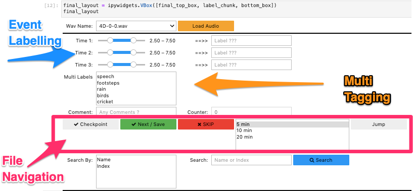

# audioAnn_GUI
A simple iPyWidgets Audio Annotator to label audio data with minimal setup and maximum convnenience.

**[ADD A GIF]**

What Is This?
-------------

We have been working with audio data for long time. It was only until custom labelling (of this audio data), we realised the dearth of tools available online. For us the core 

Setup
---------------
To run download the necessary pip packages in requirements.txt file. 

1. **ipywidgets**
2. librosa
3. matplotlib
4. pandas
5. numpy

Start Labelling
===============

1. jupyter-lab
7. Navigate to http://localhost:8888 in your browser

Current Features
----------------
Checklist based features implemented.

Future Features
----------------
To be Added (Use Checklists).

Making Requests
---------------
Please feel free to contribute to this contribute project.
